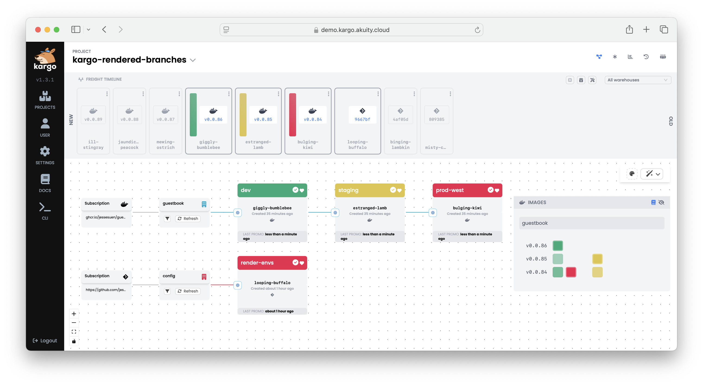

# Kargo Rendered Branches Example

This is a GitOps repository demonstrating how to use Kargo with the
[rendered manifests pattern](https://akuity.io/blog/the-rendered-manifests-pattern).

### Features:

* Pattern for rendering environment-specific branches
* Two Warehouses/pipelines:
  * The `guestbook` Warehouse for promoting the guestbook image through a three stage pipeline
  * The `config` Warehouse for rendering environment specific or shared configuration to branches
* Image tag promotion
* Git path monitoring

## Requirements

* Kargo v1.3

## Instructions

1. Fork this repo, then clone it locally (from your fork).
2. Run the `personalize.sh` to customize the manifests to use your GitHub
   username:

   ```shell
   ./personalize.sh <yourgithubusername>
   ```
3. `git commit` the personalized changes:

   ```shell
   git commit -a -m "personalize manifests"
   git push
   ```
4. Create a guestbook container image repository in your GitHub account. 

   The easiest way to create a new ghcr.io image repository, is by retagging and 
   pushing an existing image with your GitHub username:

   ```shell
   docker login ghcr.io

   docker buildx imagetools create \
     ghcr.io/akuity/guestbook:latest \
     -t ghcr.io/<yourgithubusername>/guestbook:v0.0.1
   ```

   You will now have a `guestbook` container image repository. e.g.:
   https://github.com/yourgithubusername/guestbook/pkgs/container/guestbook

5. Change guestbook container image repository to public.

   In the GitHub UI, navigate to the "guestbook" container repository, Package
   settings, and change the visibility of the package to public. This will allow
   Kargo to monitor this repository for new images, without requiring you to 
   configuring Kargo with container image repository credentials.

   

6. Download and install the latest CLI from [Kargo Releases](https://github.com/akuity/kargo/releases/latest)

   ```shell
   ./download-cli.sh /usr/local/bin/kargo
   ```

7. Login to Kargo:

   ```shell
   kargo login --admin https://<kargo-url>
   ```

8. Apply the Kargo manifests:

   ```shell
   kargo apply -f ./kargo
   ```

9. Add the Git repository credentials to Kargo. This can also be done in the UI
   in the `kargo-rendered-branches` Project.

   ```shell
   kargo create credentials github-creds \
     --project kargo-rendered-branches \
     --git \
     --username <yourgithubusername> \
     --repo-url https://github.com/<yourgithubusername>/kargo-rendered-branches.git
   ```

   As part of the promotion process, Kargo requires privileges to commit changes
   to your Git repository, as well as the ability to create pull requests. Ensure
   that the given token has these privileges.

10. Promote the image!

    You now have a Kargo Pipeline which promotes images from the guestbook
    container image repository, through a three-stage deploy pipeline. Visit
    the `kargo-rendered-branches` Project in the Kargo UI to see the deploy pipeline.

    

    To promote, click the target icon to the left of the `dev` Stage, select
    the detected Freight, and click `Yes` to promote. Once promoted, the Freight
    will be qualified to be promoted to downstream Stages (`staging`, `prod`).

    After promotion look at the env branches (`env/dev`, `env/staging`,
    `env/prod`) to see the rendered YAML.

11. Promote a manifest change

    Edit an environment specific values change or to the shared helm chart. 
    e.g. to:
      * [`charts/guestbook/values.yaml`](./charts/guestbook/values.yaml)
      * [`env/dev/values.yaml`](env/dev/values.yaml)
   
    Refresh the `config` Warehouse to detect the change. Promote the change
    to all environments by promoting to the `render-envs` Stage. After promotion,
    the env branches will reflect the manifest change in the rendered YAML.
